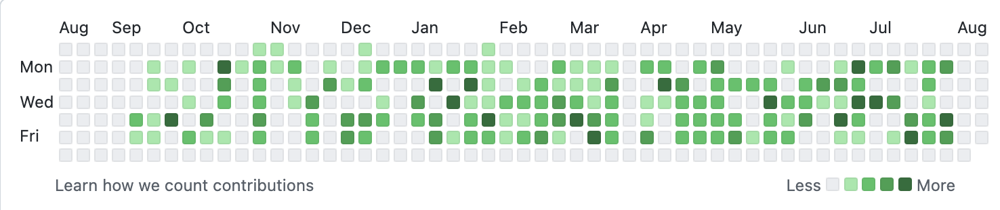

### Hi there 👋

- 🔭 I’m currently working on [Jusrelate Group GmbH](https://www.justrelate.com/)
- 💬 I'm currently programming with React.js
- 🌱 I’m currently learning Associate AWS and Advanced NodeJs
- 📫 Reach me at **kadirumac49@gmail.com**

<!-- <h3>My Project Background</h3>

<h4>Gamescom</h4>

<h4>Provinzial</h4>

 -->
 

  

  

### Connect with me:

<a href="https://www.linkedin.com/in/kadirumac/" target="_blank"> Vist my LinkedIn or</a> => <a href="https://kadirumac.netlify.app/">Visit my Website</a>

 
 

 

<h3>Second  github Account</h3>

<h3 align="left">Languages:</h3>

    
  
    
    
      
       
        
      
  <h3 align="left">Tools:</h3>

 

       

     

    

      
      
    

               
    

      
    

     

